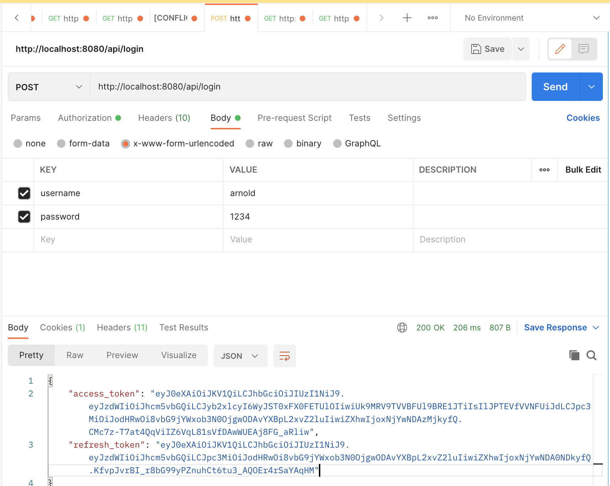
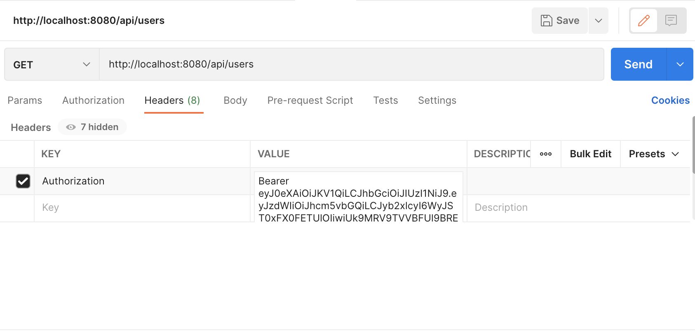
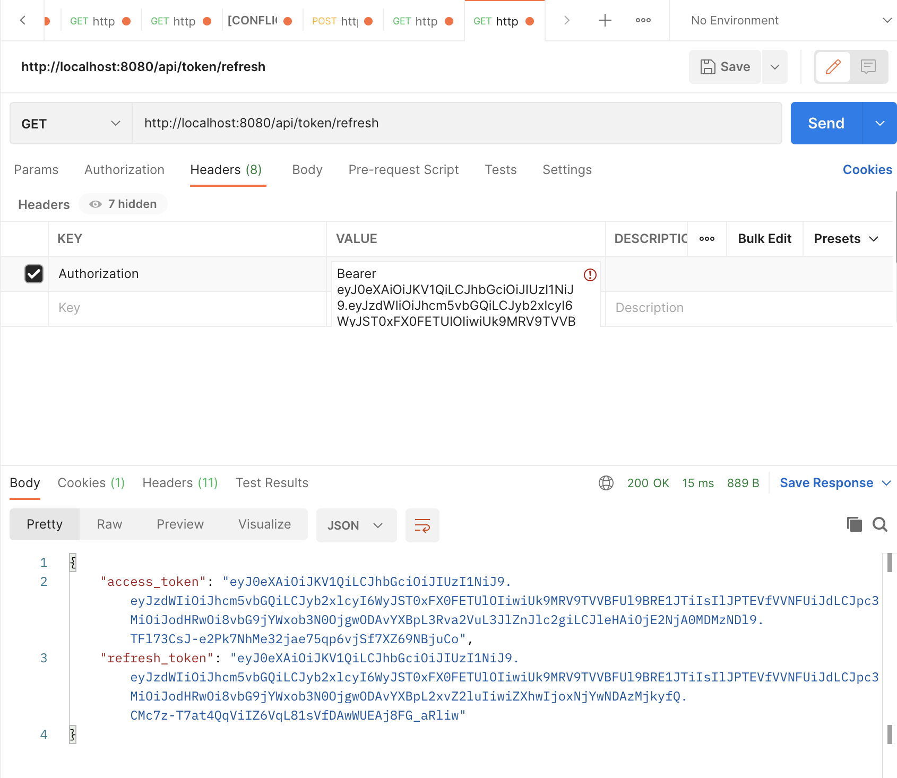

# SpringBoot Authentication and Authorization Application

##Authentication

The application takes the user credentials i.e. username and password and authentictes the user and providers the access token and refresh token:

http://localhost:8080/api/login

To call a service using the authorization token:

http://localhost:8080/api/users

To generate a access token using the refresh token

http://localhost:8080/api/token/refresh

